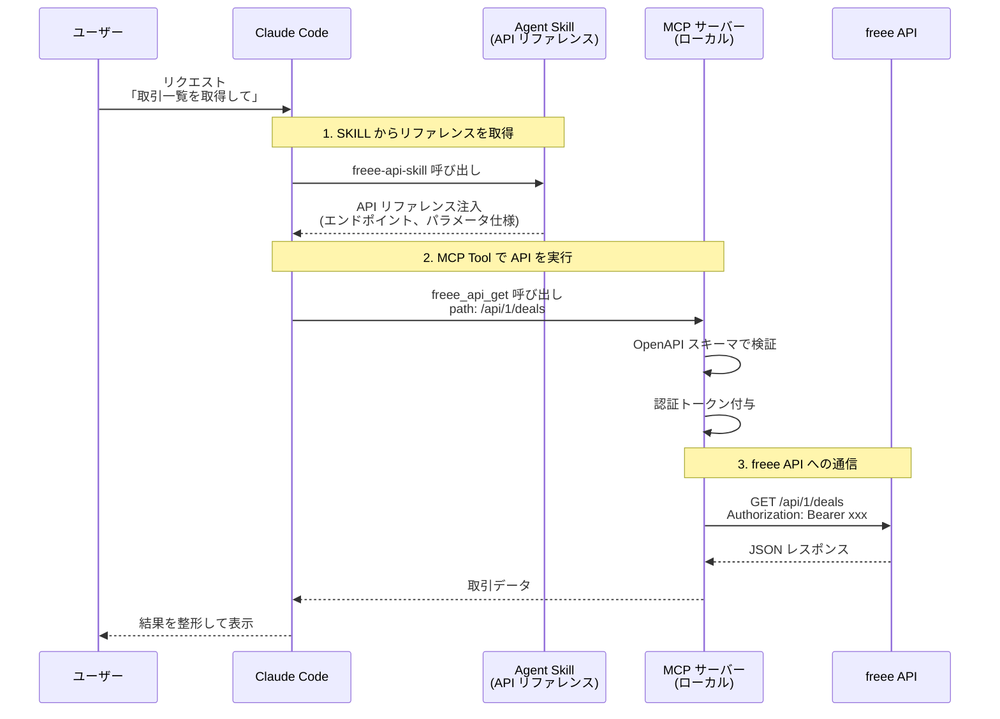

# @him0/freee-mcp

freee API を Claude から使えるようにする MCP サーバー & Claude Plugin です。

MCP サーバー（API 呼び出し機能）と skill（API リファレンス）を組み合わせて利用することを想定しています。

[](https://www.npmjs.com/package/@him0/freee-mcp)

> Note: このプロジェクトは開発中であり、予期せぬ不具合が発生する可能性があります。問題を発見された場合は [Issue](https://github.com/him0/freee-mcp/issues) として報告していただけると幸いです。

## 特徴

- MCP サーバー: freee API を Claude Desktop / Claude Code から直接呼び出し
- Claude Plugin: 詳細な API リファレンスドキュメント付きスキルを提供
- 複数 API 対応: 会計・人事労務・請求書・工数管理・販売の5つの freee API をサポート
- OAuth 2.0 + PKCE: セキュアな認証フロー、トークン自動更新
- 複数事業所対応: 事業所の動的切り替えが可能

## SKILL と MCP の通信の流れ

Claude Code では、SKILL（API リファレンス）と MCP サーバー（API 呼び出し）を組み合わせて利用します。



この仕組みにより：
- SKILL: 必要な API リファレンスを段階的にコンテキストに注入（コンテキスト効率化）
- MCP: 認証・リクエスト検証・API 呼び出しを担当

## クイックスタート

### 1. freee アプリケーションの登録

[freee アプリストア](https://app.secure.freee.co.jp/developers) で新しいアプリを作成:

- コールバックURL: `http://127.0.0.1:54321/callback`
- Client ID と Client Secret を取得
- 必要な権限にチェック

### 2. セットアップ

```bash
npx @him0/freee-mcp configure
```

対話式ウィザードが認証情報の設定、OAuth認証、事業所選択を行います。

### 3. Claude Desktop に追加

`configure` が出力する設定を Claude Desktop の設定ファイルに追加:

| OS      | 設定ファイルパス                                                  |
| ------- | ----------------------------------------------------------------- |
| macOS   | `~/Library/Application Support/Claude/claude_desktop_config.json` |
| Windows | `%APPDATA%\Claude\claude_desktop_config.json`                     |
| Linux   | `~/.config/Claude/claude_desktop_config.json`                     |

```json
{
  "mcpServers": {
    "freee": {
      "command": "npx",
      "args": ["@him0/freee-mcp"]
    }
  }
}
```

> ⚠️ 環境変数での設定について
> 環境変数（`FREEE_CLIENT_ID`、`FREEE_CLIENT_SECRET` など）を使った設定は非推奨です。
> 代わりに `npx @him0/freee-mcp configure` を実行して設定ファイルに移行してください。
> 環境変数設定は将来のバージョンで削除される予定です。

## Claude Plugin として使う

Claude Code でプラグインとしてインストールすると、API リファレンス付きのスキルが利用できます:

```bash
npx add-skill him0/freee-mcp
```

[add-skill](https://github.com/anthropics/add-skill) は Claude Code、Cursor、OpenCode など複数のコーディングエージェントに対応したスキルインストーラーです。グローバルインストール(`-g`)や特定スキルのみのインストール(`-s`)も可能です。

### 含まれるリファレンス

| API      | 内容                                         | ファイル数 |
| -------- | -------------------------------------------- | ---------- |
| 会計     | 取引、勘定科目、取引先、請求書、経費申請など | 31         |
| 人事労務 | 従業員、勤怠、給与明細、年末調整など         | 27         |
| 請求書   | 請求書、見積書、納品書                       | 3          |
| 工数管理 | ユーザー情報                                 | 1          |
| 販売     | 案件、受注                                   | 2          |

Claude との会話中に API の使い方を質問すると、これらのリファレンスを参照して正確な情報を提供します。

### データ作成のベストプラクティス

請求書や経費精算など、同じ形式のデータを繰り返し作成する場合は、以前に作成したデータを参照することで効率的に作業できます：

- 請求書作成: 過去の請求書を取得して、取引先・品目・税区分などを参考にする
- 経費精算: 過去の申請を参照して、勘定科目や部門の指定を正確に行う
- 取引登録: 類似の取引を参考にして、入力ミスを防ぐ

```
例: 「先月の○○社への請求書を参考に、今月分を作成して」
```

## 利用可能なツール

### 管理ツール

| ツール                     | 説明               |
| -------------------------- | ------------------ |
| `freee_authenticate`       | OAuth 認証を実行   |
| `freee_auth_status`        | 認証状態を確認     |
| `freee_clear_auth`         | 認証情報をクリア   |
| `freee_set_current_company`| 事業所を切り替え   |
| `freee_get_current_company`| 現在の事業所を表示 |
| `freee_list_companies`     | 事業所一覧を取得   |
| `freee_current_user`       | 現在のユーザー情報 |

### API ツール

HTTPメソッドごとのシンプルなツール構成:

| ツール                 | 説明               | 例                 |
| ---------------------- | ------------------ | ------------------ |
| `freee_api_get`        | データ取得         | `/api/1/deals`     |
| `freee_api_post`       | 新規作成           | `/api/1/deals`     |
| `freee_api_put`        | 更新               | `/api/1/deals/123` |
| `freee_api_delete`     | 削除               | `/api/1/deals/123` |
| `freee_api_patch`      | 部分更新           | `/api/1/deals/123` |
| `freee_api_list_paths` | エンドポイント一覧 | -                  |

パスは OpenAPI スキーマに対して自動検証されます。

### company_id の取り扱い

リクエスト（パラメータまたはボディ）に `company_id` を含める場合、現在の事業所と一致している必要があります。不一致の場合はエラーになります。

- 事業所の確認: `freee_get_current_company`
- 事業所の切り替え: `freee_set_company`
- company_id を含まない API（例: `/api/1/companies`）はそのまま実行可能

## コントリビューション

Issue での不具合報告や機能要望、フィードバックは大歓迎です！

このリポジトリでは AI を活用した開発フローを採用しており、issue をもとに実装することでコードの一貫性と品質を保っています。
そのため、ホワイトリストに登録されていないユーザーからの PR は自動的に close され、代わりに提案内容を反映した issue が作成されます。
メンテナーが issue をもとに実装方針を検討し、対応を進めます。

### Contributors

<!-- CONTRIBUTORS-START -->
<a href="https://github.com/dais0n"></a>
<a href="https://github.com/HikaruEgashira"></a>
<a href="https://github.com/nakanoasaservice"></a>
<a href="https://github.com/worldscandy"></a>
<!-- CONTRIBUTORS-END -->

## 開発者向け

```bash
git clone https://github.com/him0/freee-mcp.git
cd freee-mcp
pnpm install

pnpm dev           # 開発サーバー（ウォッチモード）
pnpm build         # ビルド
pnpm typecheck    # 型チェック
pnpm lint          # リント
pnpm test:run      # テスト

# API リファレンスの再生成
pnpm generate:references
```

### 技術スタック

TypeScript / Model Context Protocol SDK / OAuth 2.0 + PKCE / Zod / esbuild

### アーキテクチャ詳細

プロジェクトのアーキテクチャ、内部構造、開発ガイドラインについては [CLAUDE.md](./CLAUDE.md) を参照してください。

## ライセンス

ISC

## コミュニティ

質問や情報交換は Discord サーバーで行っています。お気軽にご参加ください。

- [Discord サーバー](https://discord.gg/9ddTPGyxPw)

## 関連リンク

- [紹介記事: Public API を MCP化するとき Agent Skill 併用が良さそう with freee-mcp](https://zenn.dev/him0/articles/766798ca1315e0)
- [freee API ドキュメント](https://developer.freee.co.jp/docs)
- [Model Context Protocol](https://modelcontextprotocol.io)
