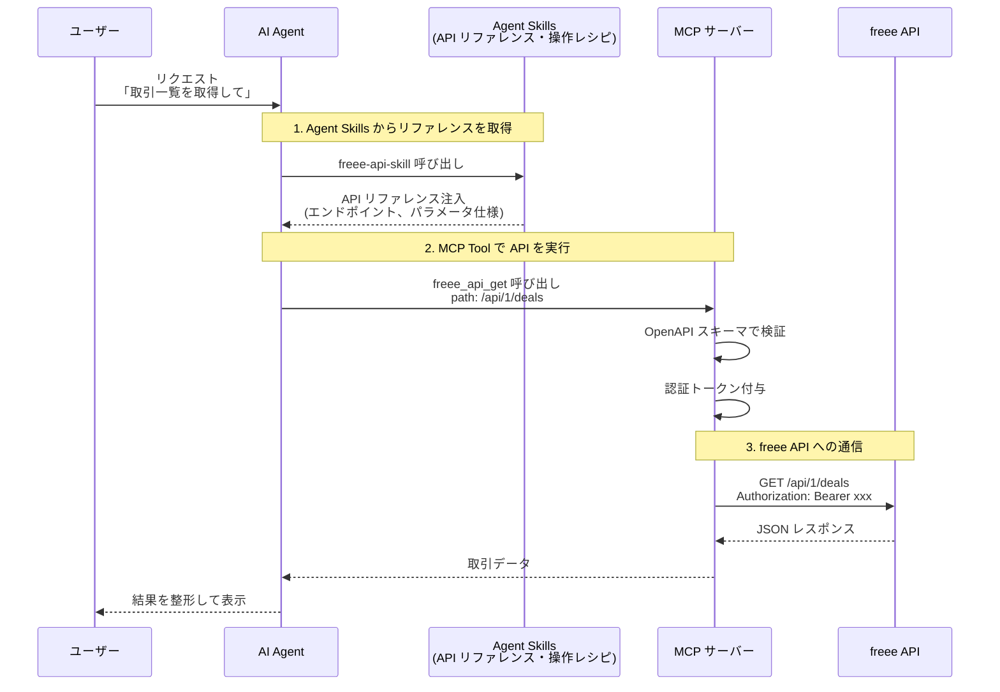
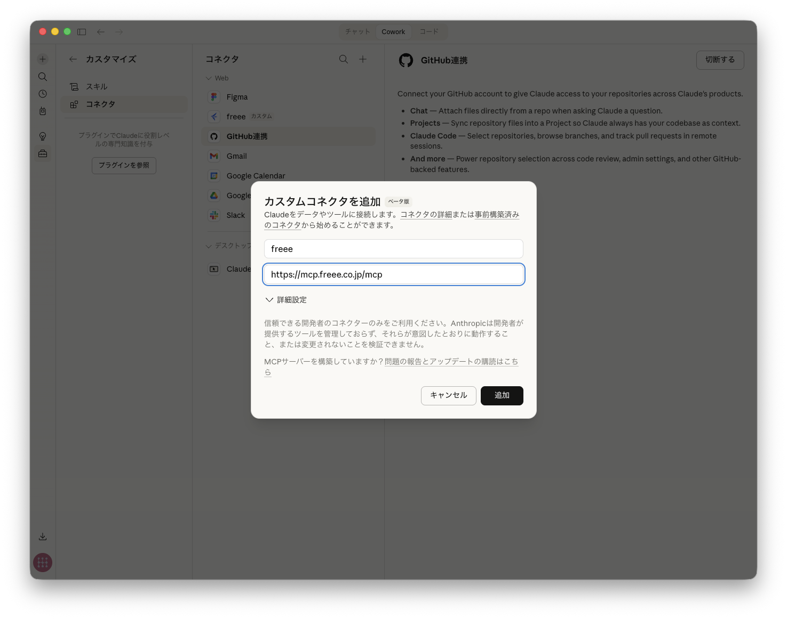
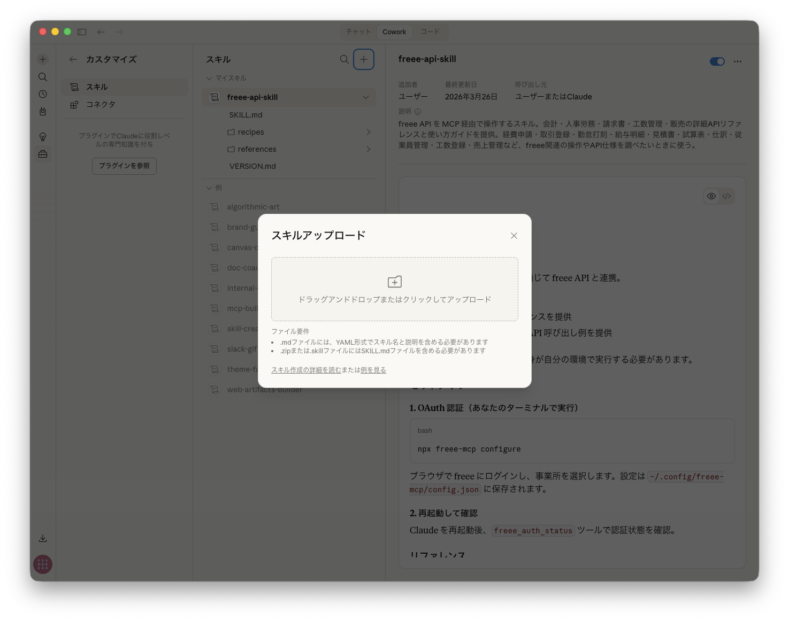

# freee-mcp

freee会計、人事労務、請求書、工数管理、販売を AI Agent から操作できるようにする freee 公式の MCP サーバーと Agent Skills です。

- MCP サーバー: freee API の呼び出し・認証・リクエスト検証を担当
- Agent Skills: API リファレンスと操作レシピを AI Agent のコンテキストに注入し、正確な API 利用をガイド

[](https://www.npmjs.com/package/freee-mcp)

## 特徴

- 複数 API 対応: 会計・人事労務・請求書・工数管理・販売の5つの freee API をサポート
- OAuth 2.0 + PKCE: セキュアな認証フロー、トークン自動更新
- 複数事業所対応: 事業所の動的切り替えが可能

## Agent Skills と MCP の通信の流れ

Agent Skills（API リファレンス・操作レシピ）と MCP サーバー（API 呼び出し）を組み合わせて利用します。


```mermaid
sequenceDiagram
    participant User as ユーザー
    participant Agent as AI Agent
    participant Skill as Agent Skills<br/>(API リファレンス・操作レシピ)
    participant MCP as MCP サーバー
    participant API as freee API

    User->>Agent: リクエスト<br/>「取引一覧を取得して」

    Note over Agent,Skill: 1. Agent Skills からリファレンスを取得
    Agent->>Skill: freee-api-skill 呼び出し
    Skill-->>Agent: API リファレンス注入<br/>(エンドポイント、パラメータ仕様)

    Note over Agent,MCP: 2. MCP Tool で API を実行
    Agent->>MCP: freee_api_get 呼び出し<br/>path: /api/1/deals
    MCP->>MCP: OpenAPI スキーマで検証
    MCP->>MCP: 認証トークン付与

    Note over MCP,API: 3. freee API への通信
    MCP->>API: GET /api/1/deals<br/>Authorization: Bearer xxx
    API-->>MCP: JSON レスポンス

    MCP-->>Agent: 取引データ
    Agent-->>User: 結果を整形して表示
```

この仕組みにより：
- Agent Skills: 必要な API リファレンスや操作レシピを段階的にコンテキストに注入（コンテキスト効率化）
- MCP: 認証・リクエスト検証・API 呼び出しを担当

## クイックスタート

### 方法 1: Remote MCP で接続する（推奨）

freee が提供する Remote MCP サーバーに接続する方法です。ローカルでのセットアップが不要で、すぐに利用を開始できます。

Claude 及び Claude Desktop では「カスタマイズ」より「カスタムコネクタを追加」を開き、以下を設定してください。

- 名前: `freee`
- URL: `https://mcp.freee.co.jp/mcp`

> ⚠️ freee 公式以外の URL を入力しないようにご注意ください。



その他の AI ツールでは、それぞれの案内に従って Remote MCP サーバーを追加してください。

### 方法 2: ローカルで MCP サーバーを起動する

freee アプリケーションを自分で登録し、ローカルで MCP サーバーを起動する方法です。

#### 2-1. freee アプリケーションの登録

[freee アプリストア](https://app.secure.freee.co.jp/developers) で新しいアプリを作成:

- コールバックURL: `http://127.0.0.1:54321/callback`
- Client ID と Client Secret を取得
- 必要な権限にチェック

#### 2-2. セットアップ

```bash
npx freee-mcp configure
```

対話式ウィザードが認証情報の設定、OAuth認証、事業所選択を行います。

#### 2-3. Claude Desktop に追加

`configure` が出力する設定を Claude Desktop の設定ファイルに追加:

```json
{
  "mcpServers": {
    "freee": {
      "command": "npx",
      "args": ["freee-mcp"]
    }
  }
}
```

Windows Store (Microsoft Store) 版の Claude Desktop をご利用の場合、設定ファイルのパスが異なります。`freee-mcp configure` は自動的に適切なパスを検出します。
## Agent Skills をインストールする

Claude 及び Claude Desktop では「カスタマイズ」より「スキル」を開き、[Releases](https://github.com/freee/freee-mcp/releases) ページから最新の `freee-api-skill.zip` をダウンロードしてアップロードしてください。



Claude Code 等のコーディングエージェント（Cursor, OpenCode など）では、[skills](https://www.npmjs.com/package/skills) でインストールできます。

```bash
npx skills add freee/freee-mcp
```

グローバルインストール(`-g`)や特定スキルのみのインストール(`-s`)も可能です。

## Claude Code Plugin として使う

Claude Code でプラグインとしてインストールすると、MCP サーバーと Agent Skills（API リファレンス・操作レシピ）がまとめて利用できます。

```bash
claude plugin install freee/freee-mcp
```

## Agent Skills の内容

| API      | 内容                                             | ファイル数 |
| -------- | ------------------------------------------------ | ---------- |
| 会計     | 取引、勘定科目、取引先、請求書、経費申請など     | 31         |
| 人事労務 | 従業員、勤怠、給与明細、年末調整など             | 28         |
| 請求書   | 請求書、見積書、納品書                           | 3          |
| 工数管理 | プロジェクト、チーム、パートナー、工数、ユーザーなど | 7          |
| 販売     | 案件、受注、マスタ                               | 5          |

AI Agent との会話中に freee API の操作を依頼すると、これらのリファレンスやレシピを参照して正確に実行します。

## データ作成のベストプラクティス

請求書や経費精算など、同じ形式のデータを繰り返し作成する場合は、以前に作成したデータを参照することで効率的に作業できます：

- 請求書作成: 過去の請求書を取得して、取引先・品目・税区分などを参考にする
- 経費精算: 過去の申請を参照して、勘定科目や部門の指定を正確に行う
- 取引登録: 類似の取引を参考にして、入力ミスを防ぐ

```
例: 「先月の○○社への請求書を参考に、今月分を作成して」
```

## 利用可能なツール

### 管理ツール

| ツール                     | 説明               |
| -------------------------- | ------------------ |
| `freee_authenticate`       | OAuth 認証を実行   |
| `freee_auth_status`        | 認証状態を確認     |
| `freee_clear_auth`         | 認証情報をクリア   |
| `freee_set_current_company`| 事業所を切り替え   |
| `freee_get_current_company`| 現在の事業所を表示 |
| `freee_list_companies`     | 事業所一覧を取得   |
| `freee_current_user`       | 現在のユーザー情報 |
| `freee_server_info`        | サーバー情報取得   |

### API ツール

HTTPメソッドごとのシンプルなツール構成:

| ツール                 | 説明               | 例                 |
| ---------------------- | ------------------ | ------------------ |
| `freee_api_get`        | データ取得         | `/api/1/deals`     |
| `freee_api_post`       | 新規作成           | `/api/1/deals`     |
| `freee_api_put`        | 更新               | `/api/1/deals/123` |
| `freee_api_delete`     | 削除               | `/api/1/deals/123` |
| `freee_api_patch`      | 部分更新           | `/api/1/deals/123` |
| `freee_api_list_paths` | エンドポイント一覧 | -                  |

パスは OpenAPI スキーマに対して自動検証されます。

### company_id の取り扱い

リクエスト（パラメータまたはボディ）に `company_id` を含める場合、現在の事業所と一致している必要があります。不一致の場合はエラーになります。

- 事業所の確認: `freee_get_current_company`
- 事業所の切り替え: `freee_set_current_company`
- company_id を含まない API（例: `/api/1/companies`）はそのまま実行可能

## コントリビューション

詳しくは [CONTRIBUTING.md](./CONTRIBUTING.md) をご覧ください。

### Contributors

<!-- CONTRIBUTORS-START -->
<a href="https://github.com/him0"></a>
<a href="https://github.com/dais0n"></a>
<a href="https://github.com/HikaruEgashira"></a>
<a href="https://github.com/nakanoasaservice"></a>
<a href="https://github.com/tackeyy"></a>
<a href="https://github.com/worldscandy"></a>
<a href="https://github.com/akhr77"></a>
<a href="https://github.com/trpfrog"></a>
<a href="https://github.com/hoshinotsuyoshi"></a>
<a href="https://github.com/JeongJaeSoon"></a>
<a href="https://github.com/norimura114"></a>
<a href="https://github.com/akiras-ssrd"></a>
<a href="https://github.com/inoue2002"></a>
<a href="https://github.com/jacknocode"></a>
<a href="https://github.com/tnj"></a>
<a href="https://github.com/jaxx2104"></a>
<a href="https://github.com/kbyk004"></a>
<a href="https://github.com/k4200"></a>
<a href="https://github.com/fukumayuta"></a>
<!-- CONTRIBUTORS-END -->

## 開発者向け

```bash
git clone https://github.com/freee/freee-mcp.git
cd freee-mcp
bun install

bun run dev           # 開発サーバー（ウォッチモード）
bun run build         # ビルド
bun run typecheck    # 型チェック
bun run lint          # リント
bun run test:run      # テスト

# API リファレンスの再生成
bun run generate:references
```

### 技術スタック

TypeScript / Model Context Protocol SDK / OAuth 2.0 + PKCE / Zod / Bun

### アーキテクチャ詳細

プロジェクトのアーキテクチャ、内部構造、開発ガイドラインについては [CLAUDE.md](./CLAUDE.md) を参照してください。

## License / ライセンス

[Apache-2.0](./LICENSE)

## コミュニティ

質問や情報交換は Discord サーバーで行っています。お気軽にご参加ください。

- [Discord サーバー](https://discord.gg/9ddTPGyxPw)

## 関連リンク

- [紹介記事: Public API を MCP化するとき Agent Skill 併用が良さそう with freee-mcp](https://zenn.dev/him0/articles/766798ca1315e0)
- [freee API ドキュメント](https://developer.freee.co.jp/docs)
- [Model Context Protocol](https://modelcontextprotocol.io)
